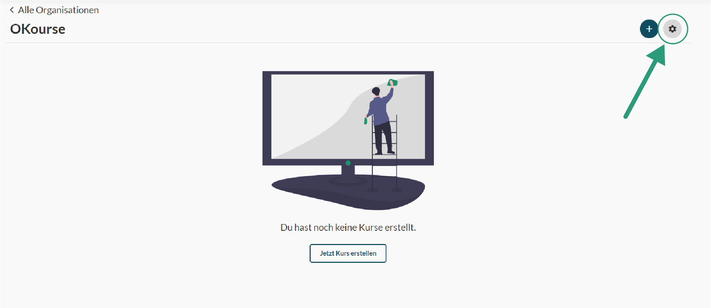
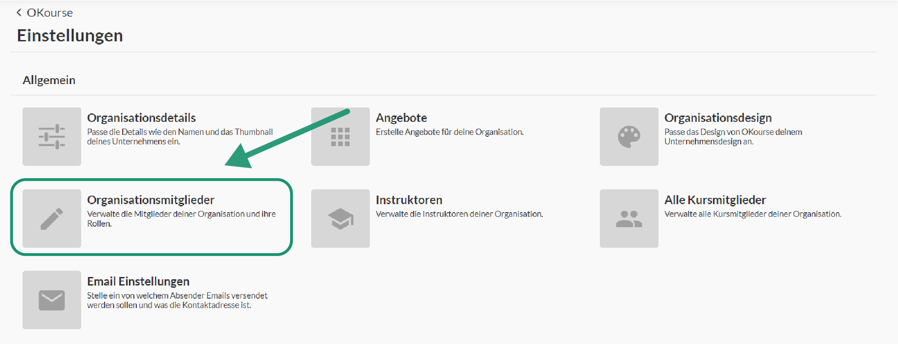
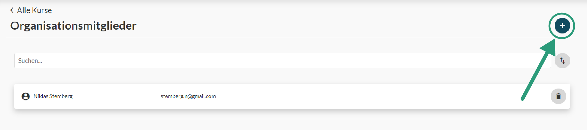
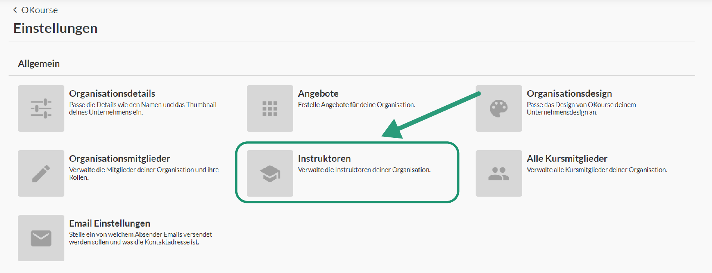
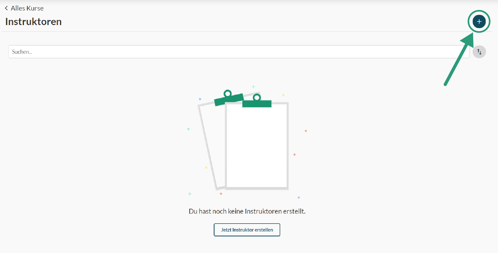
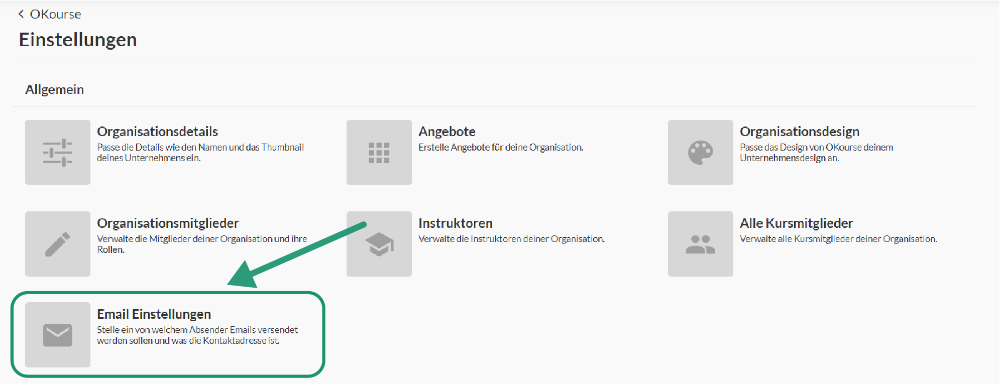
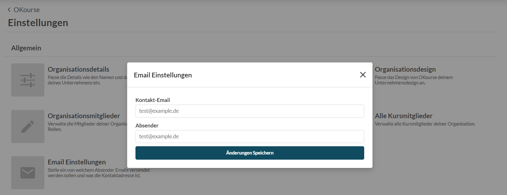

# Organisationen

#### Erstellen
Zum Erstellen einer Organisation musst du ledigleich den '+' Knopf in der Organisationsübersicht deines OKourse Accounts klicken. Im Anschluss musst du ein paar Organisationsdetails wie den Namen und die Beschreibung hinzufügen. Zusätzlich kannst du schon hier ein Thumbnail für deine Organisation hochladen.

#### Einstellungen

Nachdem du deine Zahlungsdaten angegeben und dich für einen Plan entschieden hast, kannst du deine Organisation verwenden. Die Einstellungen deiner Organisation findest du in der oberen rechten Ecke.

#### Organisationsmitglieder

In dein Einstellungen kannst du der Organisation Mitglieder hinzufügen. Organisationsmitglieder können verschiedene Rollen haben. Jede dieser Rollen gibt dem Nutzer entsprechende Berechtigungen innerhalb der Organisation.
Die Rolle ‚Support‘ kann lediglich Information einsehen aber nur sehr begrenzt bearbeiten. So kann der Support keine Kursinhalte bearbeiten, jedoch Kursmitglieder und deren Zugänge verwalten.
Die Rolle ‚Editor‘ kann einen Großteil der Inhalte bearbeiten und einsehen. Lediglich die Zahlungsarten und das Abonemment können nicht durch diese Rolle angepasst werden.
Die Rolle ‚Creator‘ besitzt nur der Ersteller einer Organisation. Nur dieser hat die Möglichkeit Zahlungsdaten zu ändern oder die Organisation zu löschen.

#### Instruktoren

Instruktoren sind die Personen, welche die Kurse als Lehrer durchgeführt haben. Diesen kannst du Kurse zuordnen.
Bei den Instruktoren handelt es sich nicht Nutzeraccounts.
Instruktoren kannst du nachfolgend in den Kursen als Kursinstruktoren hinzufügen.

#### Email-Einstellungen

In den Email-Einstellungen kannst du zusätzlich Einstellen von welchem Absender die Emails für Mitglieder deiner Kurse versendet werden sollen. Wenn du den Absender „Test“ eingibst lautet die Absende-Adresse „test@okourse.com“. 
Als Kontakt-Email kannst du zusätzlich auswählen an welche Email sich deine Nutzer bei Prolemen melden können. 

