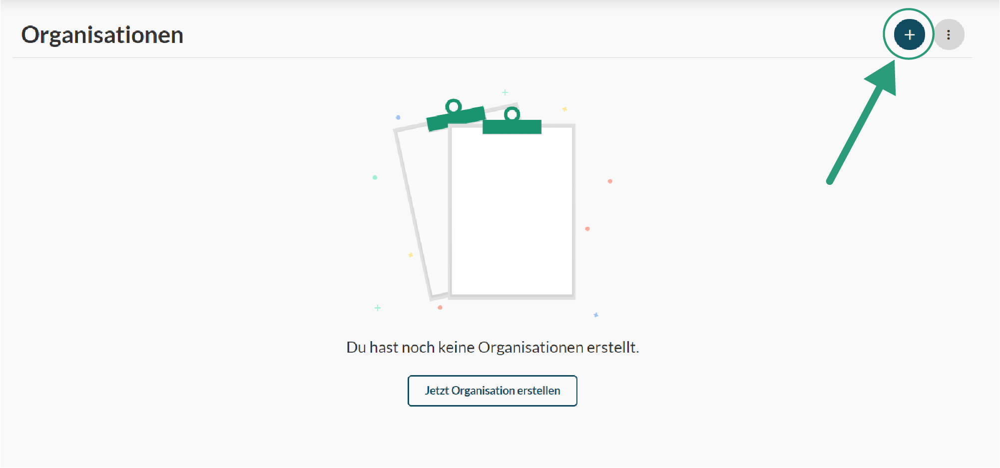

# Organisationen

#### Erstellen Test
Zum erstellen eine Organisation musst du ledigleich den '+' Knopf in der Organisationsübersicht deines OKourse Accounts klicken. Im Anschluss musst du ein paar Organisationsdetails wie den Namen und die Beschreibung hinzufügen. Zusätzlich kannst du schon hier ein Thumbnail für deine Organisation hochladen dadurch stellst du sicher, dass alle deine Organisation sofort wiedererkennen.

#### Einstellungen

Nachdem du deine Zahlungsdaten angegeben hast und dich für einen Plan entschieden hast, kannst du deine Organisation verwenden. Die Einstellungen deiner Organisation findest du oben rechts in der Ecke.

#### Organisationsmitglieder

In dein Einstellungen kannst du der Organisation Mitglieder hinzufügen. Organisationsmitglieder können verschieden Rollen haben wodurch sie verschiedene Berechtigungen innerhalb einer Organisation erhalten. 
Dir Rolle ‚Support‘ kann lediglich Information einsehen aber nur sehr begrenzt bearbeiten. So kann der support keine Kursinhalte bearbeiten allerdings Kursmitglieder und deren Zugänge verwalten.
Die Rolle ‚Editor‘ kann einer Großteil der Inhalte bearbeiten und einsehen. Lediglich die Zahlungsarten und das Abonemment können nicht durch diese Rolle angepasst werden.
Die Rolle ‚Creator‘ besitzt nur der Ersteller einer Organisation. Nur dieser hat die Möglichkeit Zahlungsdaten zu ändern oder die Organisation gar zu löschen.

#### Instruktoren

Neben den Organisationsmitgliedern kannst du auch die Instruktoren deiner Organisation verwalten. Instruktoren kannst du nachfolgend in den Kursen als Kursinstruktoren hinzufügen.

#### Email-Einstellungen

In den Email-Einstellungen kannst du zusätzlich einstellen von welchem Absender die Emails für Mitglieder deiner Kurse versendet werden sollen. Wenn du den Absender „Test“ eingibst lautet die Absende-Adresse „test@okourse.com“. Als Kontakt-Email kannst du zusätzlich auswählen an welche Email sich deine Nutzer bei Prolemen melden können.
