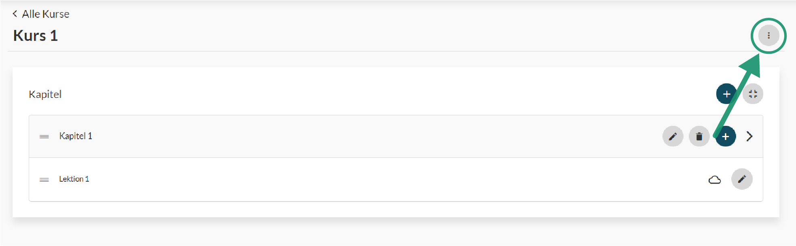

# Kurse

#### Erstellen 

Innerhalb einer Organisation sind alle darin enthaltenen Kurse zu finden. Kurse können durch klicken des ‚+‘ Knopfes und unter Angabe vom Kurstitel, Kursbeschreibung etc. hinzugefügt werden. Alle Informationen können nach der Erstellung noch bearbeitet werden.

#### Kursinhalte

Ist der Kurs einmal erstellt können nun die entsprechenden Inhalte hinzugefügt bzw. angepast werden. Über den ‚+‘ Knopf können hier neue Kapitel und darin sogenannte Lektionen erstellt werden. Mehr zum Thema Lektionen findest du im nächsten Abschnitt. Kapitel und Lektionen können mittels Drag & Drop in ihrer Position innerhalb des Kurses verschoben werden. Dazu musst du an den Markierungen am Anfang der Elemente klicken und gedrückt halten.

#### Startseite

Die Startseite eines Kurses kann über das Menü ‚Startseite anpassen‘ bearbeitet werden. In diesem Fenster kannst du die Willkommenstexte schreiben sowie Bilder und Werbung platzieren. Solltest du keine der genannten Informationen eingeben, erhält der Nutzer als Startseite eine Übersicht über die Kursinhalte.

#### Drip Funktion

Kapitel können mit einer sogenannten ‚Drip‘ Funktion ausgestattet werden. Das hießt, dass Kapitel innerhalb eines Kurses nach der Freischaltung dem Nutzer erst Schritt für Schritt freigegeben werden. Dazu kannst du angeben wie viele Tage nach Kursbeitritt der Nutzer jedes einzelne Kapitel freigegeben bekommen soll. Alternativ kannst du Kursmitgliedern im Mitglieder Menü auch ein Häckchen bei ‚Voller Zugriff‘ setzen. Dadurch erhält das Kursmitglied direkten Zugriff auf die vollständigen Kapitel des Kurses.

