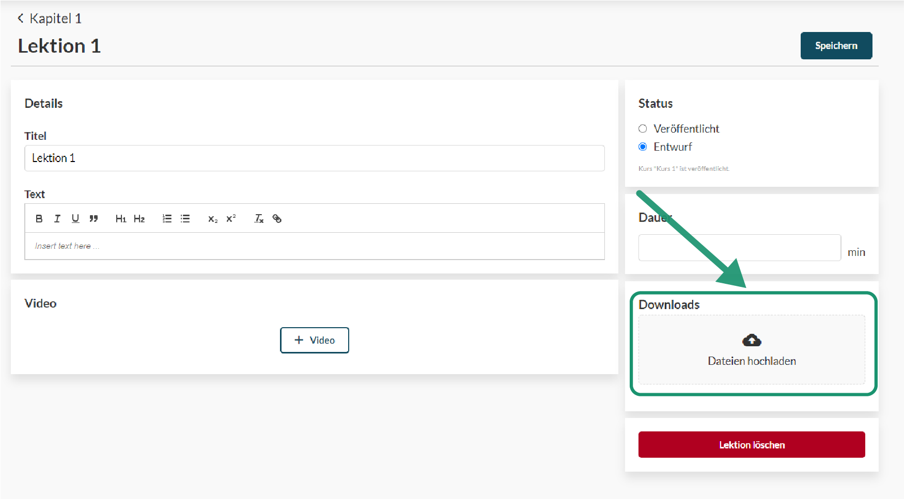
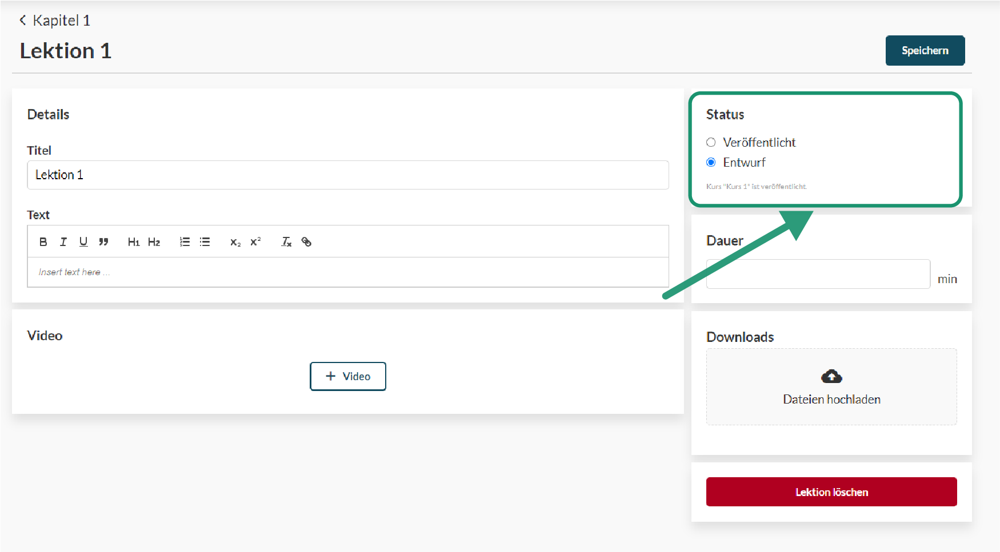
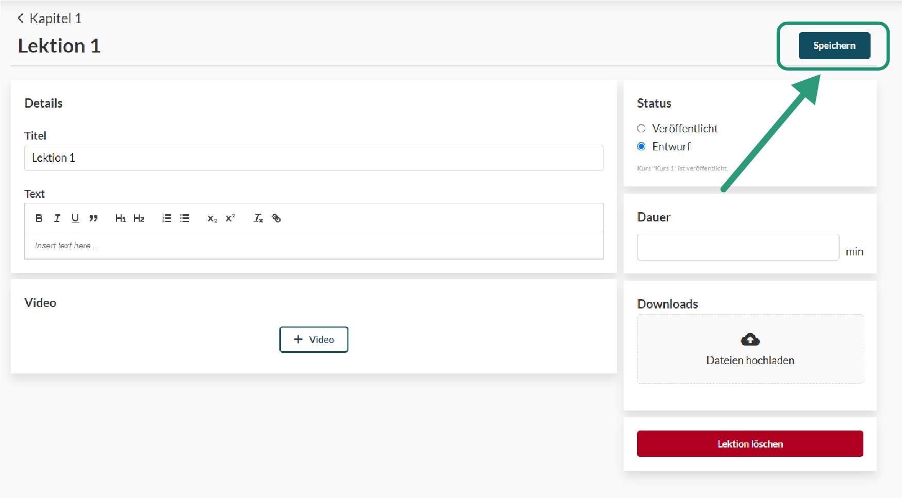
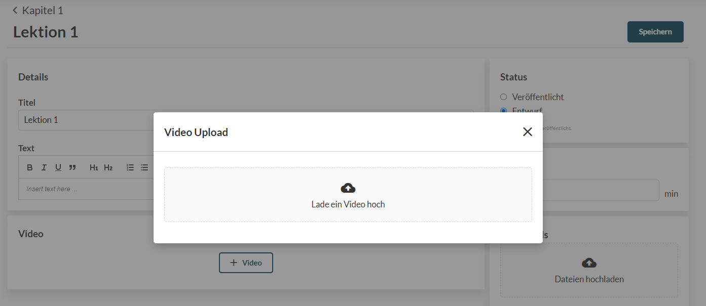

# Lektionen

#### Inhalte

Die Lektionen eines Kurses sind die kleinste Informationseinheit bei OKourse. Eine Lektion kann ein bestimmtes Video, Textinhalte, Grafiken oder ein Quiz sein. Eine Lektion ist dabei immer genau einem Kapitel zugeordnet.
An jede Lektion können Dokumente zum Download angehängt werden.

#### Status

Sinn des Status ist es, dass nur Inhalte für die Nutzer zu sehen sind, welche diese auch wirklich sehen sollen.
Um nun eine Lektion für Kursmiteglieder zu veröffentlichen, muss der Status der Lektion von "Entwurf" auf "Veröffentlicht" gestellt werden.

Änderung an einer Lesktion müssen stets gespeichert werden, damit diese nicht verloren gehen.

#### Videos

Zum Hochladen von Videos kannst du diese per Drag & Drop auf das dafür vorgesehene Feld ziehen oder auf selbiges Klicken um die entsprechende Datei aus dem Dateisystem auszuwählen. Nachdem der Upload abgeschlossen ist und das Video verarbeitet wurde, kann ein Thumbnail hochgeladen werden, welches vor dem Abspielen des Videos sichtbar ist.

