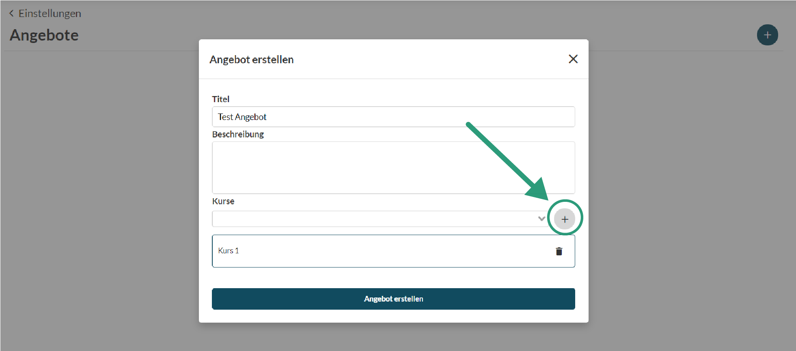
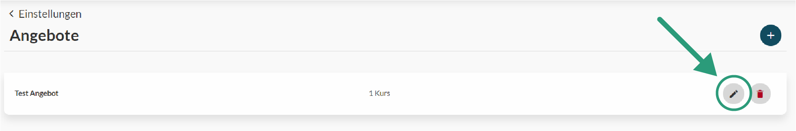
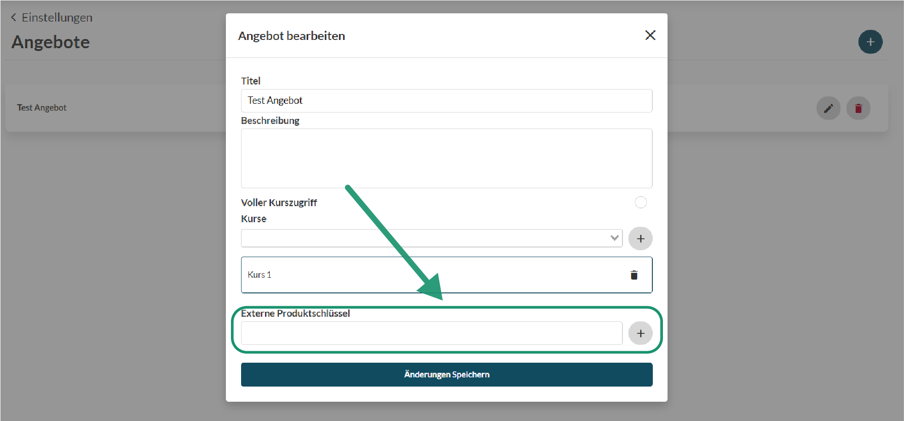

# Angebote

#### Inhalt

Kurse werden in Okourse nicht einzeln freigegeben sondern in sogenannten Angeboten gebündelt. 
Ein Angebot kann dabei ein oder mehrere Kurse enthalten. 

Grund dafür ist, dass sich dadurch unterscheidliche Kurspakete zusammenstellen lassen. Beispielsweise wenn ein Abomodell angeboten werden soll, kann ein Angebot erstellt und die passenden Kurse hinzugefügt werden.

Wichtig ist, da der Zugriff auf Kurse über die Angebote läuft, dass für jeden Kurs der einzeln freigeschaltet werden soll auch ein Angebot mit diesem einen Kurs als Inhalt erstellt werden muss.

Wenn Kurse nachträglich einem Angebot hinzugefügt oder entnommen werden, spiegelt sich dies ebenfalls in dem Zugriff für die Kursmitglieder wider.

In der Konfigura

#### Externe Produktschlüssel

Die externen Produktschlüssel eines Angebots stellen die Verbindung zu dem Bezahlungsdienstleister deiner Wahl dar. In dieser Liste kannst du alle Produkt IDs angeben welche auf dieses spezielle Angebot verweisen. Wenn ein Nutzer nun das Produkt mit der ID 1234 kauft wird uns das von deinem Bezahlungsdienstleister mitgeteilt und wir schalten dem Nutzer das Angebot mit dem externen Produktschlüssel 1234 frei. Der Nutzer bekommt in der Folge Zugriff auf alle Kurse die in diesem Angebot enthalten sind.

Einen Angebot können mehrere externe Produktschlüssel zugeordnet werden. Jedoch kann ein externer Produktschlüssel nur einem Angebot zugeordnet werden. Ein Angebot benötigt mindestens einen externen Produktschlüssel.

