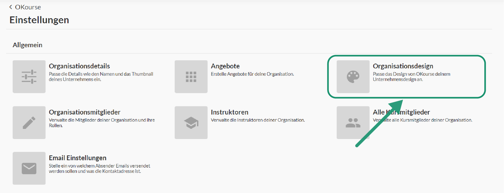
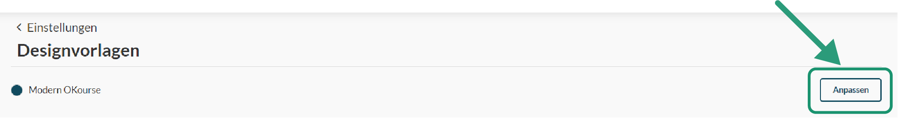
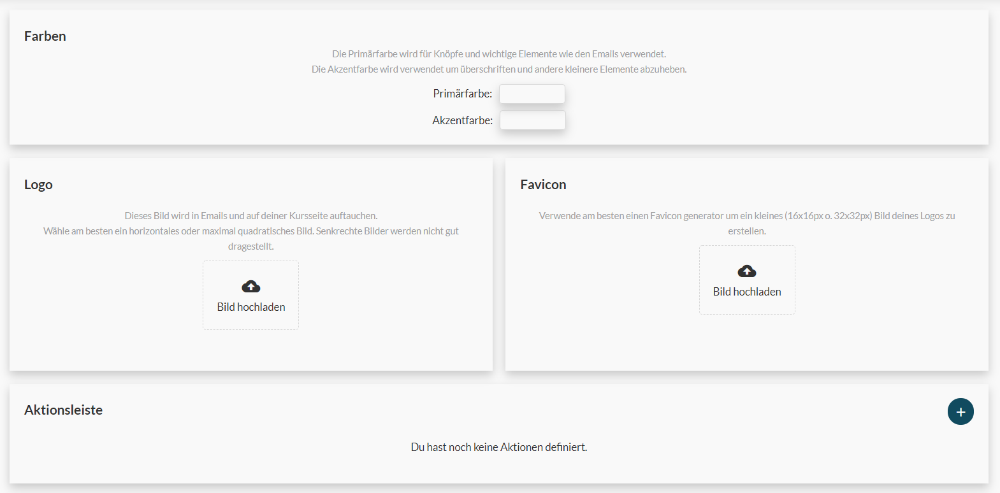

# Design

#### Designvorlage

Du kannst das Aussehen der OKourse Oberfläche und der Mails nach deinem belieben anpassen. Primär- und Sekundärfarben sowie Logos können von dir individuell eingestellt werden. So haben Kursmitglieder nicht das Gefühl sich auf irgendeiner Kursplattform zu befinden sondern haben eine individuelle Nutzererfahrung.

#### Anpassungen

Zum Bearbeiten des Designs kannst du in den Organisations-Einstellungen zunächst eine Designvorlage auswählen. Diese Designvorlage kannst du dann mit den vorgegebenen Optionen nach deinem belieben anpassen. Anpassungen an der Designvorlage gelten stets für die gesamte Organisation.

