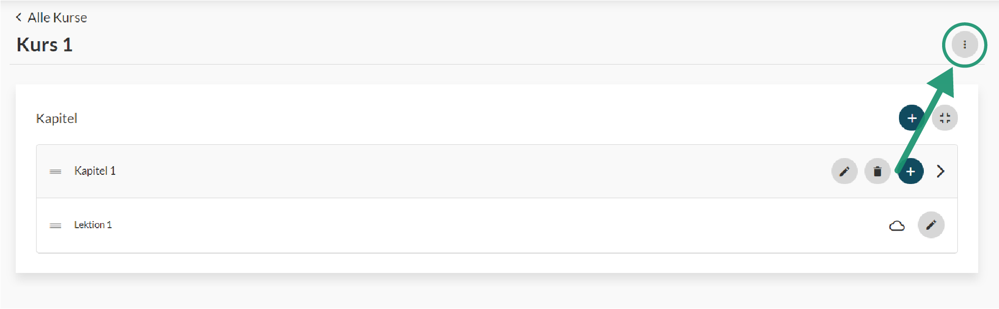
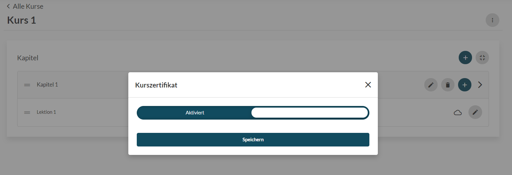

# Zertifikate

#### Aktivierung

Okourse bietet die Möglichkeit, dass Kursmitglieder bei erfolgreichem Abschluss eines Kurses ein Zertifikat ausgestellt bekommen. Dabei handelt es sich um ein PDF, welches auch auf den sozialen Netzwerken geteilt werden kann.
Du kannst für deine Kursmitglieder bei erfolgreichem Abschluss eines Kurses Kurszertifikate ausstellen lassen. 

Auf dem Kurszertifikat sind der Name des Nutzers, der abgeschlossene Kurs und das Abschlussdatum zu finden.
Die Kurszertifikate können für jeden Kurs individuell aktiviert bzw. deaktiviert werden.

Das Design des Zertifikats richtet sich nach den Primär- und Sekundärfarben sowie Logos, welche in dem Organisationsdesign festgelegt worden sind.

#### Teilen

Über den Zertifikatslink kann das Zertifikate über soziale Netzwerke geteilt werden. Dadurch sehen Dritte, dass das Zertifikat auch tatsächlich von OKourse ausgestellt worden ist.
