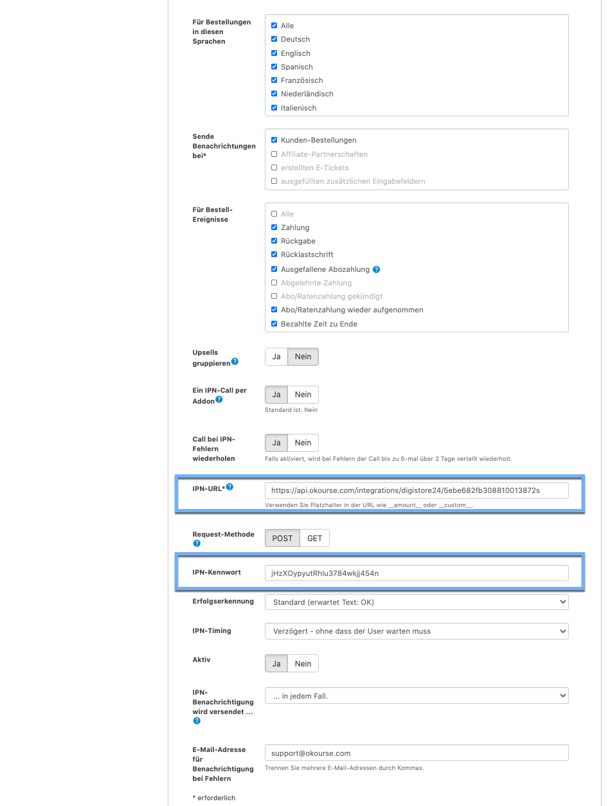

# Zahlungsdienstleister

#### Auswahl

Da OKourse dir die Freiheit lassen möchte den Zahlungsdienstleister deiner Wahl zu verwenden, haben wir keinen festen Zahlungsanbieter eingebettet. Dafür haben wir Schnittstellen eingerichtet, welche es dir ermöglichen deinen eigenen Anbieter anzuschließen.

#### Integration

Okourse bietet unterschiedliche Schnittstellen für die Abwicklung von Zahlungen an. Weitere Anbieter werden nach und nach ergänzt.

### Digistore

Um den Zahlungsanbieter Digistore zu integrieren, navigiere in die Organisationseinstellungen und klicke dort auf das Panel "Integrationen".
Diese dort für Digistore genannten Zugangsdaten benötigst du, um eine Vernindung von Digistore zu Okourse herzustellen.

Um nun die Verbindung herstellen zu können, lege in Digistore unter Einstellungen "IPN-Verbindung" eine neue Verbindung an. Der Verbindungstyp ist "IPN Generisch".
Eine Beispielkonfiguration der Verbindung ist auf dem folgenden Bild zu Erkennen.

Nach dem erfolgreichen Erstellen der Verbindung, kann diese über den Button "Verbindung testen" getestet werden.

Neben Bestellungen werden auch Rückgaben automatisiert bearbeitet. Erfolgt eine Rückgabe, wird dem Nutzer das Angebot für diese Bestellnummer entfernt.

Jede Bestellung, welche durch die Digistore Integration durchgeführt wird, bekommt ein "DIG-" vor die Bestellnummer gehängt um eine Eindeutigkeit gegenüber Bestellnummern von anderen Integrationen zu erlauben.

### General

Verwendest du beispielsweise In-App Purchases in iOS oder Android oder setzt deine eigene Zahlungslösung ein, kannst du auch mit der Integration "General" arbeiten. Um den Endpunkt für deine Requests einsehen zu können, navigiere in die Organisationseinstellungen und klicke dort auf das Panel "Integrationen". Unter "General" ist die URL für die Organisation zu finden.

Die genaue Verwendung ist ist in der API Dokumentation näher beschrieben.